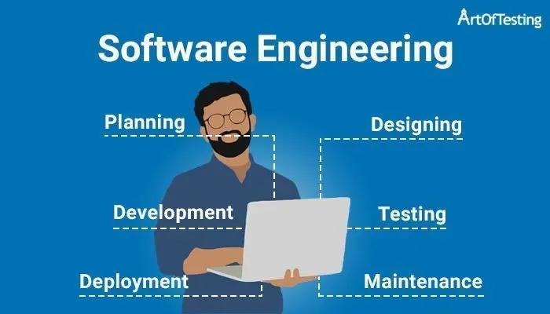

# Why take ICS 314
ICS 314 has been one of the most monumental classes I've taken because in this class you learn about software engineering fundamentals that are important to know when trying to become a software engineer or going into any other engineering modalities. The concepts I learned in this class are open-source software development, configuration management, functional programming, development environments, coding standards, user interface frameworks, agile project management, design patterns, and ethics in software engineering. This course does a great job teaching these concepts because we get to learn them through hands on experiences and incorporate them in our projects.

# What I Will Carry With Me
A few concepts that will stick with me as I move along in my career as a computer engineer are coding standards, agile project management, and development environments. The coding standards concept taught me how to keep my code uniform when working in a large team that are editing and adding things to the same code. This helps minimize any confusions in readability amongst members in the group/team since everyone has their own way of writing code.

The agile project management is a concept that is mostly used in small groups and is driven by issues. From this I learned how to incorporate GitHub and create an organization page which is where your team will have this space to share any work done on the project and find out what to do next. The big picture of this concept is its progress is driven by issues. These issues are to be completed within a 3-day timeframe and it doesn’t prevent others from working on another issue. The purpose for this is so that there can be continuous progress made towards completing the project as there will always be another issue to work on after completing one. GitHub also has some helpful features that make collaboration easier such as having the ability to push and pull code and it will check if there will be any problems when doing so. It also has a UI for creating issues and sorting them into groups that we can call milestones to see the progress being made. This concept combined with coding standards creates the ultimate team management system because the agile project management concept link coding standards with the group members.

Finally, the development environment concept is about learning what integrated development environment (IDE) is going to be the best to use based on the application/language you are creating/using. These three concepts are the most important to me as I can use them in settings such as working on operating systems (OS), and I am on a team designing how the OS handles the amount of memory it has access to or designing some CPU and my team is creating one using C to simulate pipelining.
