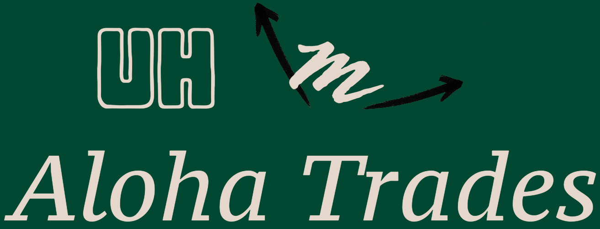

## Overview

The purpose of this project is to give UHM students, factuality, and staff a place where they can sell their school related items to other members that can benefit from their items. This is better than say Facebook Market place because most items UHM students, faculty, and staff would sell are items from a class they finished, from moving out of the dorms, or technology that is just sitting around but can benefit another member. This application is built with UHM members in mind, so a user must have a hawaii.edu account. This makes it so that no one outside of the community or school can see what people are selling and when you decide to make a purchase you'll know they are someone that's part of the campus.

## My Contributions
This project was developed with 3 other students from the class. When we first started we talked about all of our visions on how we wanted the site to work and feel in the end. The ideas I had to contribute were simple, the site was only accessible by having an account and in order to make it safer for students, an account has to use a hawaii.edu email. The next thing was what pages and components did we need to get the main portion of the site. The listings had to be shown as cards with information such as a title, image, price, condition, description, and email of the owner. One of the first pages we created was a landing page after signing-in which is where you have this overview and some options on navigating the site. 

At first I created a simple all white page that has a NavBar with the login/signup option in the top right, and footer with some basic information about our organization (team name). Overtime we added more navigation options to the NavBar, I added the background that fitted the idea this is a website for shopping and added those icons for a shopping cart, and marketplace using bootstrap icons. Another way I contributed was by obtaining our IP domain and making our website accessible on the internet. I did this by using Docker, which allocates resources to make a container, which can be thought of as a virtual machine but better, to create and run a virtual server. Essentially whenever we had a new version of the site that was ready to go live, I would push the new version and made sure everything worked by using testcafe. 

## My Experience
This project has taught me the value of communication by working in a team that has a ton of ideas but not all the time in the world to complete them so in those cases, it also taught me how to be the person who has to make the decisions on what to get done first to get the ball rolling so we can make progress and get as much done as possible. This project was also perfect in solidifying the topics taught in this class like agile project development, configuration management, deployment, and testing.

Agile project development progress is driven by issues that are small enough to complete in a few days timeframe and it doesn't hinder another developers chance to work on something else. It also allowed us to work on configuration management with GitHub. Our team did use GitHub to store and share our work which it made it easy to create branches off the main working code to work on adding features and merge it back to the main code later on without messing up the working code. Then I was able to learn how to use testcafe to create test that made sure some of the features we were making worked with every addition we created. 

# PROJECT LINKS
* [Aloha Trades Website](https://aloha-trades.com)
* 
* [Aloha Trades Organization Page](https://aloha-trades.github.io)
* [Aloha Trades Organization Page (GitHub)](https://github.com/aloha-trades)
