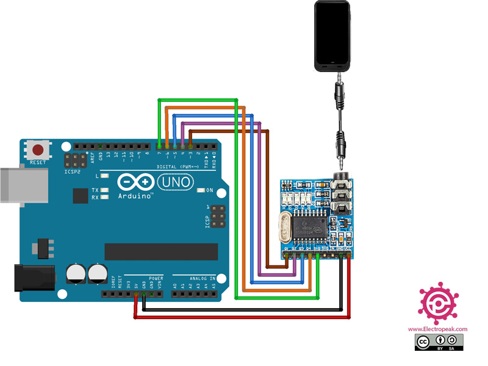

  The purpose of this project was to make a replacement component for the speaker systems in the fire stations because the component in place is not being produced anymore and it was the only one of its types that fit the speaker system we were using. So, if this device stopped working there would be a replacement part. This project was given to me and so I set out trying to figure out what parts I'd needed to make this work. First, I asked how the current device works and it works by receiving combinations of dial tones frequencies which is read by the device and when the right combination is received it triggers the stations speakers to turn on. Luckily for me there was an attachment that could be hooked up to an Arduino. The attachment is called the MT8870, and it worked by retrieving the sound frequency through a 3.5mm jack which goes through the decoder chip and lights up LEDs -built on the board in binary. So, for example if a 1 dial tone was received it'd display 0001.

  The interesting thing I learned from this project is what is contained in a dial tone frequency and how the MT8870 can decode it. For instance, the number 5 would be 0101 in binary. To properly output this the device is taking the frequency and breaking it down to 0's and 1's. So, what I mean is in the number 5 dial tone, it is made up of 0 and 1 translated in the frequency. So, the device reads the first bit, which would read a 0 and then it would have to shift that bit to the left by 1 to receive the next bit 1 and continue until the tone is finished. So that's how were left with 0101.

  
```
  toneVal = 0;                                //Initialize stored value to 0.
  toneVal |= digitalRead(Q4) << 3;            //Shift the first digit recieved 3 over.
  toneVal |= digitalRead(Q3) << 2;            //Shift next digit recieved 2 over.
  toneVal |= digitalRead(Q2) << 1;            //Shift following digit recieved 1 over.
  toneVal |= digitalRead(Q1);                 //Leave last digit recived.
```
