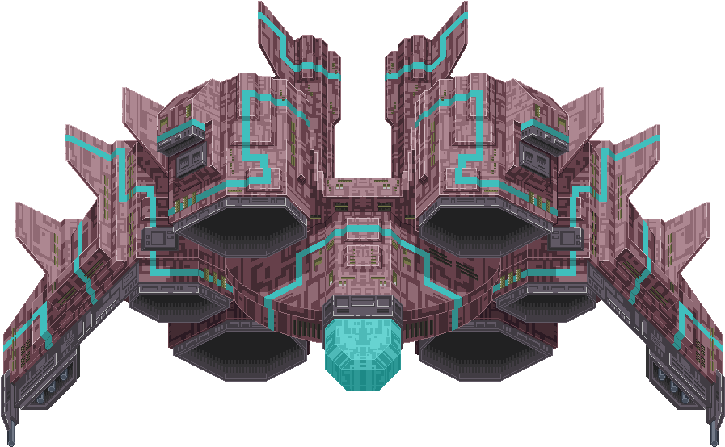

<div class="text-center p-4">
  
  
  
</div>

  This was a group project I worked on which was also our capstone project for EE205 which shows the professor and other students that we understand how to use C++ and most importantly knew how to work together as a team. The task of this assignment was to create a video game using SFML, which is an interface you can use to make games. We wanted our game to be simple and we didn't really have a long period of time to make up a game from scratch, so we based our game from the infamous 2D game Space Invaders. At a high level it was simple to design, you’re controlling a spaceship that could move all around the screen and the only things you must worry about are asteroids that were being hurdled at you from the top of the screen down and at the end you fight a boss. So, for those parts we created objects and put images of an asteroid, a small blue spaceship as your playable character, and a big green ship as the boss on top of those objects. This gave us the ability to give the objects health, projectiles, damage, collision, and movement properties. 

  Aside from developing what should be in our project, I was tasked with creating our main menu. I had essentially only needed to put three options on there, 1 for starting the game, 2 for showing the controls, and 3 to exit the game.

  ```
Menu::Menu(float width, float height){
	font.loadFromFile("../graphics/CaviarDreams.ttf");
	
	menu[0].setFont(font);
	menu[0].setFillColor(sf::Color::Red);
	menu[0].setString("Play");
	menu[0].setPosition(sf::Vector2f(50, height/(MAX_NUMBER_OF_ITEMS + 1) * 1));

	menu[1].setFont(font);
	menu[1].setFillColor(sf::Color::White);
	menu[1].setString("Controls");
	menu[1].setPosition(sf::Vector2f(50, height/(MAX_NUMBER_OF_ITEMS + 1) * 2));

	menu[2].setFont(font);
	menu[2].setFillColor(sf::Color::White);
	menu[2].setString("Exit");
	menu[2].setPosition(sf::Vector2f(50, height/(MAX_NUMBER_OF_ITEMS + 1) * 3));

	selectedItemIndex = 0;
}

void Menu::MoveUp(){
	if(selectedItemIndex - 1 >= 0){
		menu[selectedItemIndex].setFillColor(sf::Color::White);
		selectedItemIndex--;
		menu[selectedItemIndex].setFillColor(sf::Color::Red);
	}
}

void Menu::MoveDown(){
	if(selectedItemIndex + 1 < MAX_NUMBER_OF_ITEMS){
		menu[selectedItemIndex].setFillColor(sf::Color::White);
		selectedItemIndex++;
		menu[selectedItemIndex].setFillColor(sf::Color::Red);
	}
}
```

  It was relatively a simple piece of the project, and this is the bulk of the code that took care of creating the menu window with Play, Controls, and Exit right in the center of the screen and highlighted which item was selected.

  This was one of my earlier group projects and from this experience working in a group I learned that communicating with everyone is important because you don't want to be working on something that someone has already done but they didn't make it known to everyone else. Also, I learned that I am not the only one who doesn't know how to do something and it's best to ask your questions to your teammates because most likely they had the same issue and knows how to deal with it. These kinds of hiccups slow down progress of a project so it’s best to practice keeping everyone up to date.
  
